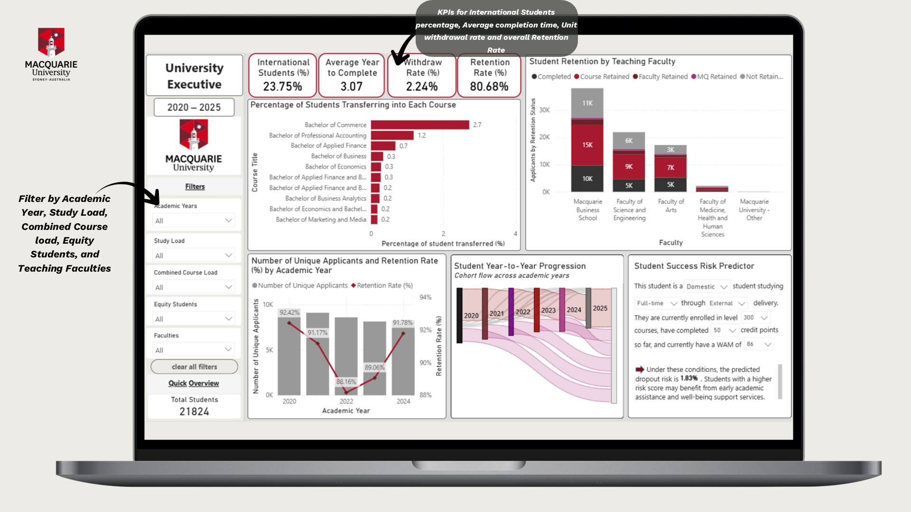

# Student Retention & Progression Analytics

**Tools:** Power BI • DAX • Data Cleaning • Data Modelling • Dashboard Design

## Project Overview

This academic group project examined student retention, withdrawal and progression patterns using de-identified institutional datasets covering 2020–2025. The objective was to help university decision-makers identify progression bottlenecks, understand differences between student cohorts and determine where earlier support may be beneficial.

The project was completed by a team of five. This repository explains the overall business problem while clearly identifying the components I personally completed. The original institutional datasets are confidential and are not included.

## Dashboard Preview



*University Executive dashboard created as part of the five-person group project. My contribution included most of the data cleaning, the student lookup and data model, retention and withdrawal KPIs, most dashboard charts, the colour scheme and the business-facing presentation. The Student Success Risk Predictor was developed by other team members.*

## Business Questions

The analysis was designed around two dashboard audiences: University Executives and Unit Convenors.

The project examined:

- How retention and withdrawal rates changed across different student cohorts
- Whether study load, academic performance and other student characteristics were associated with different outcomes
- Which units showed potential progression bottlenecks or differences between actual and expected pass rates
- Where repeat enrolments and early academic signals could indicate a need for additional support
- How university leaders could use these findings for intervention planning and resource allocation

## Data Preparation

I completed most of the enrolment-data cleaning and prepared the retention classifications used in the dashboard.

The enrolment dataset contained approximately 285,000 records across 43 fields. This was an existing de-identified dataset provided by the university for the academic project. My preparation work included:

- Profiling the dataset structure, data types and completeness
- Auditing missing values across the available fields
- Replacing missing advanced-standing, credited and completed credit points with zero where the missing value represented no recorded credit
- Labelling missing grades as `Not Graded`
- Retaining missing course-completion dates and weighted average marks where the absence carried meaningful information, rather than applying an unsupported imputation
- Created a `CODE_TAG` field classifying progression outcomes as `Course Retained`, `Faculty Retained`, `MQ Retained`, `Completed`, or `Not Retained in Year X + 1`, using continuation, completion and transfer indicators

The source datasets and student-level records are not included in this public repository due to data privacy concerns.

## Data Model, DAX and Validation

To analyse enrolment characteristics alongside year-to-year progression outcomes, I created a `Student_Lookup` table containing one distinct record per student. I used this as a bridge between the enrolment and retention datasets, avoiding a direct many-to-many relationship between the two fact tables.

The model used one-to-many, single-direction relationships from the student lookup table to the enrolment and retention tables. This allowed student-level filters to flow consistently across both datasets.

My work included:

- Creating the student lookup and bridge-table structure
- Connecting enrolment characteristics with retention outcomes
- Developing DAX measures for retention rate and withdrawal rate
- Designing measures to respond to year, faculty, study-load and cohort filters
- Testing filter behaviour when unique-student totals did not change correctly across faculties
- Investigating unusual year-level results, including the lower 2025 retention rate
- Validating whether the dashboard results reflected the underlying retention classifications

The original Power BI file and confidential source data are not included in this repository.

The university-level retention calculation followed the supplied institutional definition: students returning in academic year X+1 divided by students enrolled in year X, excluding relevant course completions in year X or X+1 where no subsequent enrolment existed. Students were counted once per academic year for the university-level measure.

## Key Findings

The completed dashboard reported:

- **80.68% overall retention**
- **2.24% unit withdrawal rate**
- **3.07 years average completion time**
- Higher retention and WAM among full-time students compared with part-time students
- Retention approximately four percentage points higher for combined-course students
- Lower retention and WAM among equity cohorts
- Large student volumes and notable retention variation across major teaching faculties

These patterns helped highlight where further investigation, targeted academic support and resource planning could be valuable.

## Limitations

- The analysis identifies descriptive patterns and associations; it does not establish that a particular student characteristic caused retention or withdrawal
- Recent cohorts have had less time to complete or demonstrate long-term retention
- Retention results depend on the classification rules used to label completion, continuation and non-retention
- Relevant factors such as student engagement, employment commitments and support-service use were not available
- The confidential source data and original Power BI model cannot be independently reproduced in this public repository
## Repository Contents

| File | Purpose |
|---|---|
| [Enrolment cleaning script](src/enrolment_cleaning.py) | Recreates the documented missing-value treatment |
| [Retention classification script](src/create_retention_code_tag.py) | Generates the five progression categories |
| [Synthetic enrolment data](data/student_enrolment_sample.csv) | Invented records for demonstrating the cleaning workflow |
| [Synthetic retention data](data/student_retention_sample.csv) | Invented year-to-year progression records |
| [Synthetic data dictionary](docs/data_dictionary.md) | Explains the fields used in the public recreation |
| [Requirements](requirements.txt) | Lists the Python dependency |

## How to Run the Public Recreation

The included scripts run only on the synthetic sample data contained in this repository.

```bash
git clone https://github.com/tejashreepillai/student-retention-analytics.git
cd student-retention-analytics
python -m venv .venv
```

On Windows:

```bash
.venv\Scripts\activate
```

Install the dependency and run both scripts:

```bash
pip install -r requirements.txt
python src/enrolment_cleaning.py
python src/create_retention_code_tag.py
```

The scripts create cleaned and classified CSV outputs locally. These generated files are excluded from GitHub through `.gitignore`.

## My Contribution

My individual contribution focused on preparing the data, developing key dashboard components and communicating the results clearly to a business audience.

- Completed the majority of the data cleaning required for analysis
- Built most of the charts used in the University Executive dashboard
- Developed the dashboard colour scheme and reviewed design options proposed by other team members
- Created the retention-rate and unit withdrawal-rate KPIs
- Developed DAX calculations supporting the dashboard metrics
- Connected the student enrolment and retention datasets so they could jointly inform the KPIs
- Redesigned the final presentation to communicate the findings in business-friendly language rather than technical jargon

The Student Success Risk Predictor was developed by other members of the project team and is not presented as my individual work. I reviewed how the predictor and its results were communicated within the final dashboard and presentation.
